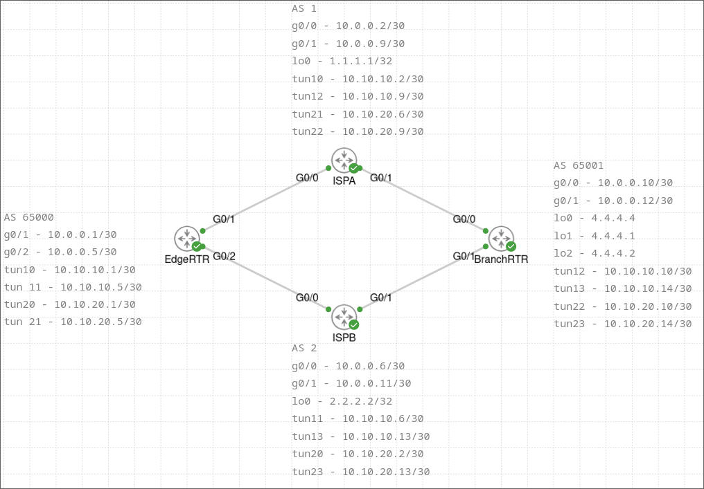

# FVRF
## Overview

This lab is the implementation of a Front door Virtual Routing and Forwarder (FVRF) with ECMP and redundancy. The FVRF is implemented on the EdgeRTR, and that isolates the traffic going to each ISP. This allows for two default routes to exist, and ECMP over the dual ISPs. Futhermore, traffic is segmented into RED and BLUE VRFs and the loopback addresses on BranchRTR simulate endpoints on both VRFs. The end result of this lab is a dual-homed ISP setup with redundancy. This means that while both ISPs are up they can both be utilized, but the network is also tolerant of one going down. 

<figure class="image"></figure>

## Edge Router

This router represents the edge of a headquarters network, and this is where the FVRF is being implemented. 

### Create VRFs

To implement this solution four VRFs need created. RED and BLUE are the service level segmentation, and ISPA and ISPB are the actual “front door” in the FVRF. They segment the traffic between the two ISPs.

```
EdgeRTR#show run | sec vrf
ip vrf BLUE
 rd 2:2
ip vrf ISPA
 rd 65000:1
ip vrf ISPB
 rd 65000:2
ip vrf RED
 rd 1:1
```

### Underlay routing

The underlay routing protocol is BGP. The AS is really just arbitrary, so I chose numbers easy to remember. 

```
EdgeRTR#show run | sec bgp
router bgp 65000
 bgp log-neighbor-changes
 !
 address-family ipv4 vrf ISPA
  bgp router-id 9.9.9.1
  neighbor 10.0.0.2 remote-as 1
  neighbor 10.0.0.2 activate
 exit-address-family
 !
 address-family ipv4 vrf ISPB
  bgp router-id 9.9.9.2
  neighbor 10.0.0.6 remote-as 2
  neighbor 10.0.0.6 activate
 exit-address-family
EdgeRTR#
```

### GRE tunnels

These GRE tunnels are fairly similar to the previous VRF lab, but they include the tunnel vrf command that specifies the VRF to put the interface in. The interface 10.10.10.1, for example, puts local and connected routes in the route table, and I want them to be in the RED VRF; however, the g0/1 interface is in the ISPA VRF. Therefore, we need that VRF to be carried over the tunnel. There are more tunnels than are shown, and the network diagram shows that each router has four tunnels configured. This is done to facilitate redundancy where there is one tunnel to each ISP for both RED and BLUE. 

```
EdgeRTR#show run int tun 10
Building configuration...

Current configuration : 182 bytes
!
interface Tunnel10
 ip vrf forwarding RED
 ip address 10.10.10.1 255.255.255.252
 tunnel source GigabitEthernet0/1
 tunnel destination 1.1.1.1
 tunnel key 10
 tunnel vrf ISPA
end

EdgeRTR#show run int tun 20
Building configuration...

Current configuration : 183 bytes
!
interface Tunnel20
 ip vrf forwarding BLUE
 ip address 10.10.20.1 255.255.255.252
 tunnel source GigabitEthernet0/2
 tunnel destination 2.2.2.2
 tunnel key 20
 tunnel vrf ISPB
end

EdgeRTR#
```

### Overlay Routing

The overlay routing protocol is EIGRP. This is fairly standard, and one AS is created for each VRF and the connected networks are advertised. 

```
EdgeRTR#show run | sec eigrp
router eigrp VRF_RED
 !
 address-family ipv4 unicast vrf RED autonomous-system 10
  !
  topology base
  exit-af-topology
  network 10.10.10.0 0.0.0.255
 exit-address-family
router eigrp VRF_BLUE
 !
 address-family ipv4 unicast vrf BLUE autonomous-system 20
  !
  topology base
  exit-af-topology
  network 10.10.20.0 0.0.0.255
 exit-address-family
EdgeRTR#
```

## ISPs and Branch router

The ISPs and Branch router are configured slightly differently because they don't have that FVRF. 

### Basic Network Connectivity

As shown below, because they aren't using the FVRF they don't need those ISPA and ISPB VRFs defined. Again, BGP is the underlay routing protocol. 

```
ISPA#show run vrf
Building configuration...

Current configuration : 204 bytes
ip vrf BLUE
 rd 2:2
!
!
ip vrf RED
 rd 1:1
!
ISPA#show run | sec bgp
router bgp 1
 bgp router-id 1.1.1.1
 bgp log-neighbor-changes
 neighbor 10.0.0.1 remote-as 65000
 neighbor 10.0.0.10 remote-as 65001
 !
 address-family ipv4
  network 1.1.1.1 mask 255.255.255.255
  neighbor 10.0.0.1 activate
  neighbor 10.0.0.10 activate
 exit-address-family
ISPA#
```

The right side of the network looks a little different than the left. The tunnel is sourced from an interface in the global routing table, loopback 0. This is because underlay connectivity is necessary for the GRE overlay to connect and form the overlay. Since the tunnels originating from the interface use different VRFs, the underlying interface needs to be in the global routing table. 

```
BranchRTR#show run int tun 12
Building configuration...

Current configuration : 154 bytes
!
interface Tunnel12
 vrf forwarding RED
 ip address 10.10.10.10 255.255.255.252
 tunnel source Loopback0
 tunnel destination 1.1.1.1
 tunnel key 12
end

BranchRTR#show run int lo0
Building configuration...

Current configuration : 63 bytes
!
interface Loopback0
 ip address 4.4.4.4 255.255.255.255
end

BranchRTR#
```

### GRE tunnels

The only difference between these GRE tunnels and the ones on the Edge router is the fact that we aren't putting these tunnels in a VRF and leaving them in the global routing table. 

```
ISPA#show run int tun 10
Building configuration...

Current configuration : 157 bytes
!
interface Tunnel10
 ip vrf forwarding RED
 ip address 10.10.10.2 255.255.255.252
 tunnel source Loopback0
 tunnel destination 10.0.0.1
 tunnel key 10
end

ISPA#
```

### Overlay routing

Again, the overlay routing is EIGRP. This is the Branch router, and it's advertising the 4.4.4.1 and 4.4.4.2 networks to give an easy test of end to end reachability. 

```
BranchRTR#show run | sec eigrp
router eigrp VRF_RED
 !
 address-family ipv4 unicast vrf RED autonomous-system 10
  !
  topology base
  exit-af-topology
  network 4.4.4.1 0.0.0.0
  network 10.10.10.0 0.0.0.255
  eigrp router-id 4.4.4.1
 exit-address-family
router eigrp VRF_BLUE
 !
 address-family ipv4 unicast vrf BLUE autonomous-system 20
  !
  topology base
  exit-af-topology
  network 4.4.4.2 0.0.0.0
  network 10.10.20.0 0.0.0.255
  eigrp router-id 4.4.4.2
 exit-address-family
BranchRTR#
```

### Verify

Now that everything is configured, there are several things to verify. First, the VRF routing tables for ISPA and ISPB should contain the direct links to the ISPs and the loopback interface shared over BGP. The RED/BLUE tunnel interfaces are also pingable from the edge router. 

```
EdgeRTR#show ip route vrf ISPA

Routing Table: ISPA
Codes: L - local, C - connected, S - static, R - RIP, M - mobile, B - BGP
       D - EIGRP, EX - EIGRP external, O - OSPF, IA - OSPF inter area 
       N1 - OSPF NSSA external type 1, N2 - OSPF NSSA external type 2
       E1 - OSPF external type 1, E2 - OSPF external type 2
       i - IS-IS, su - IS-IS summary, L1 - IS-IS level-1, L2 - IS-IS level-2
       ia - IS-IS inter area, * - candidate default, U - per-user static route
       o - ODR, P - periodic downloaded static route, H - NHRP, l - LISP
       a - application route
       + - replicated route, % - next hop override, p - overrides from PfR

Gateway of last resort is not set

      1.0.0.0/32 is subnetted, 1 subnets
B        1.1.1.1 [20/0] via 10.0.0.2, 00:08:48
      10.0.0.0/8 is variably subnetted, 2 subnets, 2 masks
C        10.0.0.0/30 is directly connected, GigabitEthernet0/1
L        10.0.0.1/32 is directly connected, GigabitEthernet0/1
EdgeRTR#show ip route vrf ISPB

Routing Table: ISPB
Codes: L - local, C - connected, S - static, R - RIP, M - mobile, B - BGP
       D - EIGRP, EX - EIGRP external, O - OSPF, IA - OSPF inter area 
       N1 - OSPF NSSA external type 1, N2 - OSPF NSSA external type 2
       E1 - OSPF external type 1, E2 - OSPF external type 2
       i - IS-IS, su - IS-IS summary, L1 - IS-IS level-1, L2 - IS-IS level-2
       ia - IS-IS inter area, * - candidate default, U - per-user static route
       o - ODR, P - periodic downloaded static route, H - NHRP, l - LISP
       a - application route
       + - replicated route, % - next hop override, p - overrides from PfR

Gateway of last resort is not set

      2.0.0.0/32 is subnetted, 1 subnets
B        2.2.2.2 [20/0] via 10.0.0.6, 00:25:13
      10.0.0.0/8 is variably subnetted, 2 subnets, 2 masks
C        10.0.0.4/30 is directly connected, GigabitEthernet0/2
L        10.0.0.5/32 is directly connected, GigabitEthernet0/2
EdgeRTR#ping vrf RED 10.10.10.2
Type escape sequence to abort.
Sending 5, 100-byte ICMP Echos to 10.10.10.2, timeout is 2 seconds:
!!!!!
Success rate is 100 percent (5/5), round-trip min/avg/max = 12/18/28 ms
EdgeRTR#ping vrf BLUE 10.10.20.2
Type escape sequence to abort.
Sending 5, 100-byte ICMP Echos to 10.10.20.2, timeout is 2 seconds:
!!!!!
Success rate is 100 percent (5/5), round-trip min/avg/max = 12/18/25 ms
EdgeRTR#
```

There should be a route to the Branch router in the RED and BLUE VRFs, and they should have multiple routes because of all those tunnels that were made earlier. 

```
EdgeRTR#show ip route vrf RED 4.4.4.1

Routing Table: RED
Routing entry for 4.4.4.1/32
  Known via "eigrp 10", distance 90, metric 102400640, type internal
  Redistributing via eigrp 10
  Last update from 10.10.10.6 on Tunnel11, 00:23:21 ago
  Routing Descriptor Blocks:
    10.10.10.6, from 10.10.10.6, 00:23:21 ago, via Tunnel11
      Route metric is 102400640, traffic share count is 1
      Total delay is 100002 microseconds, minimum bandwidth is 100 Kbit
      Reliability 255/255, minimum MTU 1472 bytes
      Loading 1/255, Hops 2
  * 10.10.10.2, from 10.10.10.2, 00:23:21 ago, via Tunnel10
      Route metric is 102400640, traffic share count is 1
      Total delay is 100002 microseconds, minimum bandwidth is 100 Kbit
      Reliability 255/255, minimum MTU 1472 bytes
      Loading 1/255, Hops 2
EdgeRTR#show ip route vrf BLUE 4.4.4.2

Routing Table: BLUE
Routing entry for 4.4.4.2/32
  Known via "eigrp 20", distance 90, metric 102400640, type internal
  Redistributing via eigrp 20
  Last update from 10.10.20.6 on Tunnel21, 00:08:59 ago
  Routing Descriptor Blocks:
    10.10.20.6, from 10.10.20.6, 00:08:59 ago, via Tunnel21
      Route metric is 102400640, traffic share count is 1
      Total delay is 100002 microseconds, minimum bandwidth is 100 Kbit
      Reliability 255/255, minimum MTU 1472 bytes
      Loading 1/255, Hops 2
  * 10.10.20.2, from 10.10.20.2, 00:08:59 ago, via Tunnel20
      Route metric is 102400640, traffic share count is 1
      Total delay is 100002 microseconds, minimum bandwidth is 100 Kbit
      Reliability 255/255, minimum MTU 1472 bytes
      Loading 1/255, Hops 2
EdgeRTR#
```

Since there are multiple routes to the destination, EIGRP will automatically do ECMP on the traffic. Traceroute demonstrates that by sending multiple pings that take the multiple paths. 

```
EdgeRTR#traceroute vrf RED 4.4.4.1
Type escape sequence to abort.
Tracing the route to 4.4.4.1
VRF info: (vrf in name/id, vrf out name/id)
  1 10.10.10.2 26 msec
    10.10.10.6 10 msec
    10.10.10.2 24 msec
  2 10.10.10.14 20 msec
    10.10.10.10 20 msec
    10.10.10.14 21 msec
  3 10.10.10.10 21 msec
    10.10.10.14 17 msec
    10.10.10.10 22 msec
EdgeRTR#traceroute vrf BLUE 4.4.4.2
Type escape sequence to abort.
Tracing the route to 4.4.4.2
VRF info: (vrf in name/id, vrf out name/id)
  1 10.10.20.2 22 msec
    10.10.20.6 23 msec
    10.10.20.2 18 msec
  2 10.10.20.10 33 msec
    10.10.20.14 34 msec
    10.10.20.10 25 msec
  3 10.10.20.14 20 msec
    10.10.20.10 26 msec
    10.10.20.14 24 msec
EdgeRTR#
```