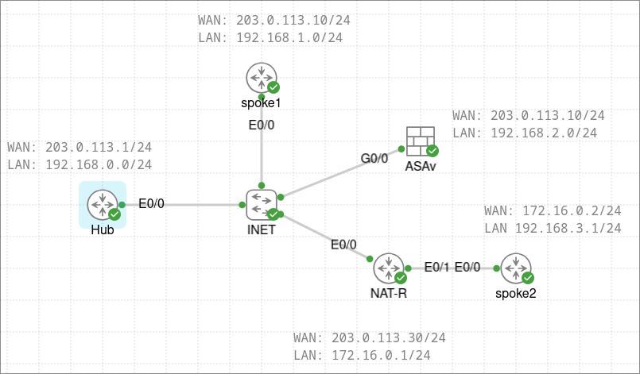

# IPsec
## Overview

This lab is attempting to cover most of the IPsec scenarios that will come up. The below topology is used. 

<figure class="image"></figure>

1.  Implement a hub/spoke IKEv1 Crypto Map solution with ASAv and spoke1 as the spokes
2.  Update to IKEv2 VTI based with PSK authentication
3.  Add spoke2 to the lab with NAT-T (spoke behind PAT)
4.  Update IPsec to use PKI authentication with Hub being the CA