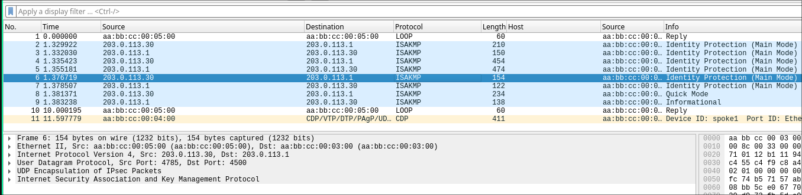

# IPsec
## Overview

This lab is attempting to cover most of the IPsec scenarios that will come up. The below topology is used. I put pretty much every issue I encountered in the troubleshooting section. This is for a few reasons, first, I want to completely document the troubleshooting process. Second, I want to compile issues for a later troubleshooting lab. This does make me look like an idiot, as there are several stupid mistakes, but it's all there. 

<figure class="image"></figure>

1.  Implement a hub/spoke IKEv1 Crypto Map solution with ASAv and spoke1 as the spokes
2.  Update to IKEv2 VTI based with PSK authentication
3.  Add spoke2 to the lab with NAT-T (spoke behind PAT)
4.  Update IPsec to use PKI authentication with Hub being the CA

## Hub and Spoke Crypto Maps

This lab is going to start off with IKEv1. So, we have to configure crypto maps and ISAKMP. The basic steps to accomplish this are listed below. This lab assumes basic network reachability. 

1.  Configure ISAKMP policy
2.  Configure ISAKMP key
3.  Configure transform set
4.  Configure ACL for VPN traffic
5.  Apply the ACL to an interface
6.  Define a route to the remote subnet

### IOS XE

```
Hub-RTR(config)#! Configure ISAKMP policy 
Hub-RTR(config)#
Hub-RTR(config)#crypto isakmp policy 10
Hub-RTR(config-isakmp)#encryption aes 256
Hub-RTR(config-isakmp)#hash sha
Hub-RTR(config-isakmp)#authentication pre-share
Hub-RTR(config-isakmp)#group 14
Hub-RTR(config-isakmp)#exit
Hub-RTR(config)#
Hub-RTR(config)#! Configure isakmp key
Hub-RTR(config)#
Hub-RTR(config)#crypto isakmp key cisco123 address 0.0.0.0
Hub-RTR(config)#
Hub-RTR(config)#! Configure transform set
Hub-RTR(config)#
Hub-RTR(config)#crypto ipsec transform-set tform esp-aes 256 esp-sha-hmac
Hub-RTR(cfg-crypto-trans)#mode tunnel !Should be the default, but just setting explicitly                               
Hub-RTR(cfg-crypto-trans)#exit
Hub-RTR(config)#
Hub-RTR(config)#! Configure the ACL that defines interesting traffic
Hub-RTR(config)#
Hub-RTR(config)#ip access-list extended 110                          
Hub-RTR(config-ext-nacl)#remark define interesting traffic
Hub-RTR(config-ext-nacl)#permit ip 192.168.0.0 0.0.0.255 192.168.1.0 0.0.0.255         
Hub-RTR(config-ext-nacl)#exit
Hub-RTR(config)#
Hub-RTR(config)#! Tie it all together in a crypto map
Hub-RTR(config)#
Hub-RTR(config)#crypto map outside_map 10 ipsec-isakmp
% NOTE: This new crypto map will remain disabled until a peer
        and a valid access list have been configured.
Hub-RTR(config-crypto-map)#set peer 203.0.113.10                 
Hub-RTR(config-crypto-map)#set transform-set tform
Hub-RTR(config-crypto-map)#match address 110
Hub-RTR(config-crypto-map)#exit
Hub-RTR(config)#
Hub-RTR(config)#! Apply crypto map to interface
Hub-RTR(config)#
Hub-RTR(config)#int e0/0
Hub-RTR(config-if)#crypto map outside_map
Hub-RTR(config-if)#ex
*Oct 25 19:11:29.491: %CRYPTO-6-ISAKMP_ON_OFF: ISAKMP is ON
Hub-RTR(config)#
Hub-RTR(config)#! Define a route to the remote subnet
Hub-RTR(config)#
Hub-RTR(config)#ip route 192.168.1.0 255.255.255.0 203.0.113.10
Hub-RTR(config)#
Hub-RTR(config)#
```

Now to verify that the connection works, interesting traffic has to match the ACL. Then the tunnel will go up. Below are the show commands that can verify this traffic. Additionally, on CML, a pcap of traffic over that link can be generated. In that pcap, the traffic originating from the 192.168.0.0/24 network is protected by ESP. The traffic that originates from the WAN interface of the router is not. 

```
Hub-RTR#ping 192.168.1.1 source 192.168.0.1
Type escape sequence to abort.
Sending 5, 100-byte ICMP Echos to 192.168.1.1, timeout is 2 seconds:
Packet sent with a source address of 192.168.0.1 

*Oct 25 19:16:01.153: %CRYPTO-4-IKMP_NO_SA: IKE message from 203.0.113.10 has no SA and is not an initialization offer.!!!!
Success rate is 80 percent (4/5), round-trip min/avg/max = 2/3/4 ms

Hub-RTR#show crypto isakmp sa
IPv4 Crypto ISAKMP SA
dst             src             state          conn-id status
203.0.113.10    203.0.113.1     QM_IDLE           1001 ACTIVE <-- The ISAKMP SA is up

IPv6 Crypto ISAKMP SA

Hub-RTR#show crypto ipsec sa

interface: Ethernet0/0
    Crypto map tag: outside_map, local addr 203.0.113.1

   protected vrf: (none)
   local  ident (addr/mask/prot/port): (192.168.0.0/255.255.255.0/0/0)
   remote ident (addr/mask/prot/port): (192.168.1.0/255.255.255.0/0/0)
   current_peer 203.0.113.10 port 500
     PERMIT, flags={origin_is_acl,}
    #pkts encaps: 4, #pkts encrypt: 4, #pkts digest: 4 <- Packets are actually traveling across this tunnel
    #pkts decaps: 4, #pkts decrypt: 4, #pkts verify: 4
    #pkts compressed: 0, #pkts decompressed: 0
    #pkts not compressed: 0, #pkts compr. failed: 0
    #pkts not decompressed: 0, #pkts decompress failed: 0
    #send errors 0, #recv errors 0
--- SHOW COMMAND CROPPED HERE ---
Hub-RTR#
```

<figure class="image"></figure>

### ASA Crypto Map Configuration

Configuring the ASA is very similar to the routers; however, the commands a just slightly different. Also, on the hub some changes need to be implemented. A peer needs to be defined in the crypto map and the ACL needs to include this new subnet. 

ASA Changes:

1.  Configure IKEv1 policy
2.  Configure tunnel group
3.  Configure ACL for interesting traffic
4.  Configure a transform set
5.  Configure and apply a crypto map

```
ASA1(config)# 
ASA1(config)# ! Configure IKEv1 policy and put on outside int
ASA1(config)# crypto ikev1 policy 10
ASA1(config-ikev1-policy)# authentication pre-share
ASA1(config-ikev1-policy)# encryption aes-256
ASA1(config-ikev1-policy)# hash sha
ASA1(config-ikev1-policy)# group 14
ASA1(config-ikev1-policy)# lifetime 86400
ASA1(config-ikev1-policy)# exit
ASA1(config)# crypto ikev1 enable outside
ASA1(config)# 
ASA1(config)# ! Configure the tunnel group
ASA1(config)# 
ASA1(config)# tunnel-group 203.0.113.1 type ipsec-l2l
ASA1(config)# tunnel-group 203.0.113.1 ipsec-attributes
ASA1(config-tunnel-ipsec)# ikev1 pre-shared-key cisco123
ASA1(config-tunnel-ipsec)# exit
ASA1(config)# 
ASA1(config)# ! Configure the ACL for VPN traffic
ASA1(config)# 
ASA1(config)# object-group network local-network
ASA1(config-network-object-group)# network-object 192.168.2.0 255.255.255.0
ASA1(config-network-object-group)# exit
ASA1(config)# object-group network hub-network
ASA1(config-network-object-group)# network-object 192.168.0.0 255.255.255.0
ASA1(config-network-object-group)# exit
ASA1(config)# access-list asa-router-vpn extended permit ip object-group local$
ASA1(config)# 
ASA1(config)# ! Configure a transform set
ASA1(config)# 
ASA1(config)# crypto ipsec ikev1 transform-set tform esp-aes-256 esp-sha-hmac
ASA1(config)# 
ASA1(config)# ! Configure a crypto map                       
ASA1(config)# 
ASA1(config)# crypto map outside_map 10 match address asa-router-vpn
ASA1(config)# crypto map outside_map 10 set peer 203.0.113.1
ASA1(config)# crypto map outside_map 10 set ikev1 transform-set tform
ASA1(config)# crypto map outside_map interface outside
ASA1(config)# 
```

And some changes need to happen on the hub.

1.  Add the new peer to the crypto map
2.  Add the new subnet to the ACL
3.  Add a route to the new subnet

```
Hub-RTR(config)#crypto map outside_map 10
Hub-RTR(config-crypto-map)#set peer 203.0.113.20
Hub-RTR(config-crypto-map)#exit
Hub-RTR(config)#
Hub-RTR(config)#! Add new ASA subnet to ACL
Hub-RTR(config)#
Hub-RTR(config)#do show access-list 110
Extended IP access list 110
    10 permit ip 192.168.0.0 0.0.0.255 192.168.1.0 0.0.0.255 (11 matches)
Hub-RTR(config)#access-list
Hub-RTR(config)#access-list 110 ?   
  <1-2147483647>  Sequence Number
  deny            Specify packets to reject
  dynamic         Specify a DYNAMIC list of PERMITs or DENYs
  permit          Specify packets to forward
  remark          Access list entry comment

Hub-RTR(config)#$rmit ip 192.168.0.0 0.0.0.255 192.168.2.0 0.0.0.255         
Hub-RTR(config)#do show access-list 110                             
Extended IP access list 110
    10 permit ip 192.168.0.0 0.0.0.255 192.168.1.0 0.0.0.255 (11 matches)
    20 permit ip 192.168.0.0 0.0.0.255 192.168.2.0 0.0.0.255
Hub-RTR(config)#
Hub-RTR(config)#! Add a new static route
Hub-RTR(config)#
Hub-RTR(config)#ip route 192.168.2.0 255.255.255.0 203.0.113.20
Hub-RTR(config)#

```

## Spoke Behind NAT

Now, we are going to add a new spoke behind NAT. Start out with just adding the same configs as spoke1, because, at the core, this is more or less the same. There is one difference however. NAT keepalives need to be added to every device. 

```
spoke2(config)#crypto isakmp nat keepalive 20

ASA1(config)# crypto isakmp nat-traversal 20
```

## Troubleshooting

Troubleshooting

### Hub and Spoke IKEv1

There were a couple of errors encounterd when configuring this topology. The most common was a lack of routes for protected subnets. That highlights the most annoying downside of IKEv1: no dynamic routing. Crypto maps don't really allow for multicast traffic which means no dynamic routing. Other than that, make sure that each peer has unique crypto map and ACL entries.  The best commands for this section were “debug crypto isakmp”, “show isakmp sa”, and “show ipsec sa”. 

#### IOS XE ←> IOS XE Crypto Map VPN 

the command “debug crypto isakmp” (use “undebug all” to stop it) will enable verbose logging for this specific function. This is the first error I encountered with this VPN. As seen below, I forgot to add the pre-shared key on the spoke to the hub. 

```
spoke1#ping 192.168.0.1 source 192.168.1.1
Type escape sequence to abort.
Sending 5, 100-byte ICMP Echos to 192.168.0.1, timeout is 2 seconds:
Packet sent with a source address of 192.168.1.1 

*Oct 25 18:50:01.497: ISAKMP: (0):SA request profile is (NULL)
*Oct 25 18:50:01.497: ISAKMP: (0):Created a peer struct for 203.0.113.1, peer port 500
*Oct 25 18:50:01.497: ISAKMP: (0):New peer created peer = 0x80007309399748E0 peer_handle = 0x8000000040000002
*Oct 25 18:50:01.497: ISAKMP: (0):Locking peer struct 0x80007309399748E0, refcount 1 for isakmp_initiator
*Oct 25 18:50:01.497: ISAKMP: (0):local port 500, remote port 500
*Oct 25 18:50:01.497: ISAKMP: (0):set new node 0 to QM_IDLE      
*Oct 25 18:50:01.497: ISAKMP: (0):insert sa successfully sa = 8000730939973AE8
*Oct 25 18:50:01.497: ISAKMP: (0):Can not start Aggressive mode, trying Main mode.
*Oct 25 18:50:01.497: ISAKMP-ERROR: (0):No pre-shared key with 203.0.113.1! <-- This is the error
*Oct 25 18:50:01.497: ISAKMP-ERROR: (0):No Cert or pre-shared address key. 
*Oct 25 18:50:01.497: ISAKMP-ERROR: (0):construct_initial_message: Can not start Main mode
*Oct 25 18:50:01.497: ISAKMP: (0):Unlocking peer struct 0x80007309399748E0 for isadb_unlock_peer_delete_sa(), count 0
*Oct 25 18:50:01.497: ISAKMP: (0):Deleting peer node by peer_reap for 203.0.113.1: 80007309399748E0
*Oct 25 18:50:01.497: ISAKMP: (0):purging SA., sa=8000730939973AE8, delme=8000730939973AE8
*Oct 25 18:50:01.497: ISAKMP: (0):purging node 1512984860
*Oct 25 18:50:01.498: ISAKMP-ERROR: (0):Error while processing SA request: Failed to initialize SA
*Oct 25 18:50:01.498: ISAKMP-ERROR: (0):Error while processing KMI message 0, error 2......
Success rate is 0 percent (0/5)
spoke1#
```

Fixing that error will get us further along in the process.

```
spoke1(config)#crypto isakmp key cisco123  address 203.0.113.1
spoke1(config)#end
spoke1#ping 19
*Oct 25 18:53:07.523: %SYS-5-CONFIG_I: Configured from console by console
spoke1#ping 192.168.0.1 source 192.168.1.1
Type escape sequence to abort.
Sending 5, 100-byte ICMP Echos to 192.168.0.1, timeout is 2 seconds:
Packet sent with a source address of 192.168.1.1 

*Oct 25 18:53:16.485: ISAKMP: (0):SA request profile is (NULL)
*Oct 25 18:53:16.485: ISAKMP: (0):Created a peer struct for 203.0.113.1, peer port 500
*Oct 25 18:53:16.485: ISAKMP: (0):New peer created peer = 0x8000730939973C58 peer_handle = 0x8000000040000004
*Oct 25 18:53:16.485: ISAKMP: (0):Locking peer struct 0x8000730939973C58, refcount 1 for isakmp_initiator
*Oct 25 18:53:16.485: ISAKMP: (0):local port 500, remote port 500
*Oct 25 18:53:16.485: ISAKMP: (0):set new node 0 to QM_IDLE      
*Oct 25 18:53:16.485: ISAKMP: (0):insert sa successfully sa = 8000730939974E40
*Oct 25 18:53:16.485: ISAKMP: (0):Can not start Aggressive mode, trying Main mode.
*Oct 25 18:53:16.485: ISAKMP: (0):found peer pre-shared key matching 203.0.113.1
*Oct 25 18:53:16.485: ISAKMP: (0):constructed NAT-T vendor-rfc3947 ID
*Oct 25 18:53:16.485: ISAKMP: (0):constructed NAT-T vendor-07 ID
*Oct 25 18:53:16.485: ISAKMP: (0):constructed NAT-T vendor-03 ID
*Oct 25 18:53:16.485: ISAKMP: (0):constructed NAT-T vendor-02 ID
*Oct 25 18:53:16.485: ISAKMP: (0):Input = IKE_MESG_FROM_IPSEC, IKE_SA_REQ_MM
*Oct 25 18:53:16.485: ISAKMP: (0):Old State = IKE_READY  New State = IKE_I_MM1 

*Oct 25 18:53:16.485: ISAKMP: (0):beginning Main Mode exchange
*Oct 25 18:53:16.485: ISAKMP-PAK: (0):sending packet to 203.0.113.1 my_port 500 peer_port 500 (I) MM_NO_STATE
*Oct 25 18:53:16.485: ISAKMP: (0):Sending an IKE IPv4 Packet.
*Oct 25 18:53:16.489: ISAKMP-PAK: (0):received packet from 203.0.113.1 dport 500 sport 500 Global (I) MM_NO_STATE
*Oct 25 18:53:16.490: ISAKMP: (0):Input = IKE_MESG_FROM_PEER, IKE_MM_EXCH
*Oct 25 18:53:16.490: ISAKMP: (0):Old State = IKE_I_MM1  New State = IKE_I_MM2 

*Oct 25 18:53:16.490: ISAKMP: (0):processing SA payload. message ID = 0
*Oct 25 18:53:16.490: ISAKMP: (0):processing vendor id payload
*Oct 25 18:53:16.490: ISAKMP: (0):vendor ID seems Unity/DPD but major 69 mismatch
*Oct 25 18:53:16.490: ISAKMP: (0):vendor ID is NAT-T RFC 3947
*Oct 25 18:53:16.490: ISAKMP: (0):found peer pre-shared key matching 203.0.113.1
*Oct 25 18:53:16.490: ISAKMP: (0):local preshared key found
*Oct 25 18:53:16.490: ISAKMP: (0):Scanning profiles for xauth ...
*Oct 25 18:53:16.490: ISAKMP: (0):Checking ISAKMP transform 1 against priority 10 policy
*Oct 25 18:53:16.490: ISAKMP: (0):      encryption AES-CBC
*Oct 25 18:53:16.490: ISAKMP: (0):      keylength of 256
*Oct 25 18:53:16.490: ISAKMP: (0):      hash SHA
*Oct 25 18:53:16.490: ISAKMP: (0):      default group 14
*Oct 25 18:53:16.490: ISAKMP: (0):      auth pre-share
*Oct 25 18:53:16.490: ISAKMP: (0):      life type in seconds
*Oct 25 18:53:16.490: ISAKMP:      life duration (VPI) of  0x0 0x1 0x51 0x80 
*Oct 25 18:53:16.490: ISAKMP: (0):atts are acceptable. Next payload is 0
*Oct 25 18:53:16.490: ISAKMP: (0):Acceptable atts:actual life: 0
*Oct 25 18:53:16.490: ISAKMP: (0):Acceptable atts:life: 0
*Oct 25 18:53:16.490: ISAKMP: (0):Fill atts in sa vpi_length:4
*Oct 25 18:53:16.490: ISAKMP: (0):Fill atts in sa life_in_seconds:86400
*Oct 25 18:53:16.490: ISAKMP: (0):Returning Actual lifetime: 86400
*Oct 25 18:53:16.490: ISAKMP: (0):Started lifetime timer: 86400.

*Oct 25 18:53:16.490: ISAKMP: (0):processing vendor id payload
*Oct 25 18:53:16.490: ISAKMP: (0):vendor ID seems Unity/DPD but major 69 mismatch
*Oct 25 18:53:16.490: ISAKMP: (0):vendor ID is NAT-T RFC 3947
*Oct 25 18:53:16.490: ISAKMP: (0):Input = IKE_MESG_INTERNAL, IKE_PROCESS_MAIN_MODE
*Oct 25 18:53:16.490: ISAKMP: (0):Old State = IKE_I_MM2  New State = IKE_I_MM2 

*Oct 25 18:53:16.491: ISAKMP-PAK: (0):sending packet to 203.0.113.1 my_port 500 peer_port 500 (I) MM_SA_SETUP
*Oct 25 18:53:16.491: ISAKMP: (0):Sending an IKE IPv4 Packet.
*Oct 25 18:53:16.491: ISAKMP: (0):Input = IKE_MESG_INTERNAL, IKE_PROCESS_COMPLETE
*Oct 25 18:53:16.491: ISAKMP: (0):Old State = IKE_I_MM2  New State = IKE_I_MM3 

*Oct 25 18:53:16.512: ISAKMP-PAK: (0):received packet from 203.0.113.1 dport 500 sport 500 Global (I) MM_SA_SETUP
*Oct 25 18:53:16.512: ISAKMP: (0):Input = IKE_MESG_FROM_PEER, IKE_MM_EXCH
*Oct 25 18:53:16.512: ISAKMP: (0):Old State = IKE_I_MM3  New State = IKE_I_MM4 

*Oct 25 18:53:16.512: ISAKMP: (0):processing KE payload. message ID = 0
*Oct 25 18:53:16.530: ISAKMP: (0):processing NONCE payload. message ID = 0
*Oct 25 18:53:16.530: ISAKMP: (0):found peer pre-shared key matching 203.0.113.1
*Oct 25 18:53:16.530: ISAKMP: (1001):processing vendor id payload
*Oct 25 18:53:16.530: ISAKMP: (1001):vendor ID is Unity
*Oct 25 18:53:16.530: ISAKMP: (1001):processing vendor id payload
*Oct 25 18:53:16.531: ISAKMP: (1001):vendor ID is DPD
*Oct 25 18:53:16.531: ISAKMP: (1001):processing vendor id payload
*Oct 25 18:53:16.531: ISAKMP: (1001):speaking to another IOS box!
*Oct 25 18:53:16.531: ISAKMP: (1001):received payload type 20
*Oct 25 18:53:16.531: ISAKMP: (1001):His hash no match - this node outside NAT
*Oct 25 18:53:16.531: ISAKMP: (1001):received payload type 20
*Oct 25 18:53:16.531: ISAKMP: (1001):No NAT Found for self or peer
*Oct 25 18:53:16.531: ISAKMP: (1001):Input = IKE_MESG_INTERNAL, IKE_PROCESS_MAIN_MODE
*Oct 25 18:53:16.531: ISAKMP: (1001):Old State = IKE_I_MM4  New State = IKE_I_MM4 

*Oct 25 18:53:16.531: ISAKMP: (1001):Send initial contact
*Oct 25 18:53:16.531: ISAKMP: (1001):SA is doing 
*Oct 25 18:53:16.531: ISAKMP: (1001):pre-shared key authentication using id type ID_IPV4_ADDR
*Oct 25 18:53:16.531: ISAKMP: (1001):ID payload 
        next-payload : 8
        type         : 1
*Oct 25 18:53:16.531: ISAKMP: (1001):   address      : 203.0.113.10
*Oct 25 18:53:16.531: ISAKMP: (1001):   protocol     : 17 
        port         : 500 
        length       : 12
*Oct 25 18:53:16.531: ISAKMP: (1001):Total payload length: 12
*Oct 25 18:53:16.532: ISAKMP-PAK: (1001):sending packet to 203.0.113.1 my_port 500 peer_port 500 (I) MM_KEY_EXCH
*Oct 25 18:53:16.533: ISAKMP: (1001):Sending an IKE IPv4 Packet.
*Oct 25 18:53:16.533: ISAKMP: (1001):Input = IKE_MESG_INTERNAL, IKE_PROCESS_COMPLETE
*Oct 25 18:53:16.533: ISAKMP: (1001):Old State = IKE_I_MM4  New State = IKE_I_MM5 

*Oct 25 18:53:16.537: ISAKMP-PAK: (1001):received packet from 203.0.113.1 dport 500 sport 500 Global (I) MM_KEY_EXCH
*Oct 25 18:53:16.537: ISAKMP: (1001):processing ID payload. message ID = 0
*Oct 25 18:53:16.538: ISAKMP: (1001):ID payload 
        next-payload : 8
        type         : 1
*Oct 25 18:53:16.538: ISAKMP: (1001):   address      : 203.0.113.1
*Oct 25 18:53:16.538: ISAKMP: (1001):   protocol     : 17 
        port         : 500 
        length       : 12
*Oct 25 18:53:16.538: ISAKMP: (0):peer matches *none* of the profiles
*Oct 25 18:53:16.538: ISAKMP: (1001):processing HASH payload. message ID = 0
*Oct 25 18:53:16.538: ISAKMP: (1001):SA authentication status:
        authenticated
*Oct 25 18:53:16.538: ISAKMP: (1001):SA has been authenticated with 203.0.113.1
*Oct 25 18:53:16.538: ISAKMP: (0):Trying to insert a peer 203.0.113.10/203.0.113.1/500/, 
*Oct 25 18:53:16.538: ISAKMP: (0): and inserted successfully 8000730939973C58.
*Oct 25 18:53:16.538: ISAKMP: (1001):Input = IKE_MESG_FROM_PEER, IKE_MM_EXCH
*Oct 25 18:53:16.538: ISAKMP: (1001):Old State = IKE_I_MM5  New State = IKE_I_MM6 

*Oct 25 18:53:16.538: ISAKMP: (1001):Input = IKE_MESG_INTERNAL, IKE_PROCESS_MAIN_MODE
*Oct 25 18:53:16.538: ISAKMP: (1001):Old State = IKE_I_MM6  New State = IKE_I_MM6 

*Oct 25 18:53:16.538: ISAKMP: (1001):Input = IKE_MESG_INTERNAL, IKE_PROCESS_COMPLETE
*Oct 25 18:53:16.538: ISAKMP: (1001):Old State = IKE_I_MM6  New State = IKE_P1_COMPLETE 

*Oct 25 18:53:16.538: ISAKMP: (1001):beginning Quick Mode exchange, M-ID of 1327257875
*Oct 25 18:53:16.538: ISAKMP: (1001):QM Initiator gets spi
*Oct 25 18:53:16.538: ISAKMP-PAK: (1001):sending packet to 203.0.113.1 my_port 500 peer_port 500 (I) QM_IDLE      
*Oct 25 18:53:16.538: ISAKMP: (1001):Sending an IKE IPv4 Packet.
*Oct 25 18:53:16.539: ISAKMP: (1001):Node 1327257875, Input = IKE_MESG_INTERNAL, IKE_INIT_QM
*Oct 25 18:53:16.539: ISAKMP: (1001):Old State = IKE_QM_READY  New State = IKE_QM_I_QM1
*Oct 25 18:53:16.539: ISAKMP: (1001):Input = IKE_MESG_INTERNAL, IKE_PHASE1_COMPLETE
*Oct 25 18:53:16.539: ISAKMP: (1001):Old State = IKE_P1_COMPLETE  New State = IKE_P1_COMPLETE 

*Oct 25 18:53:16.543: ISAKMP-PAK: (1001):received packet from 203.0.113.1 dport 500 sport 500 Global (I) QM_IDLE      
*Oct 25 18:53:16.543: ISAKMP: (1001):processing HASH payload. message ID = 1327257875
*Oct 25 18:53:16.543: ISAKMP: (1001):processing SA payload. message ID = 1327257875
*Oct 25 18:53:16.543: ISAKMP: (1001):Checking IPSec proposal 1
*Oct 25 18:53:16.543: ISAKMP: (1001):transform 1, ESP_AES 
*Oct 25 18:53:16.543: ISAKMP: (1001):   attributes in transform:
*Oct 25 18:53:16.543: ISAKMP: (1001):      encaps is 1 (Tunnel)
*Oct 25 18:53:16.543: ISAKMP: (1001):      SA life type in seconds
*Oct 25 18:53:16.543: ISAKMP: (1001):      SA life duration (basic) of 3600
*Oct 25 18:53:16.543: ISAKMP: (1001):      SA life type in kilobytes
*Oct 25 18:53:16.543: ISAKMP:      SA life duration (VPI) of  0x0 0x46 0x50 0x0 
*Oct 25 18:53:16.543: ISAKMP: (1001):      authenticator is HMAC-SHA
*Oct 25 18:53:16.543: ISAKMP: (1001):      key length is 256
*Oct 25 18:53:16.543: ISAKMP: (1001):atts are acceptable.
*Oct 25 18:53:16.543: ISAKMP: (1001):processing NONCE payload. message ID = 1327257875
*Oct 25 18:53:16.543: ISAKMP: (1001):processing ID payload. message ID = 1327257875
*Oct 25 18:53:16.543: ISAKMP: (1001):processing ID payload. message ID = 1327257875
*Oct 25 18:53:16.543: ISAKMP: (1001):Node 1327257875, Input = IKE_MESG_FROM_PEER, IKE_QM_EXCH
*Oct 25 18:53:16.543: ISAKMP: (1001):Old State = IKE_QM_I_QM1  New State = IKE_QM_IPSEC_INSTALL_AWAIT
*Oct 25 18:53:16.544: ISAKMP-ERROR: (0):Failed to find peer index node to update peer_info_list
*Oct 25 18:53:16.545: ISAKMP: (1001):Received IPSec Install callback... proceeding with the negotiation
*Oct 25 18:53:16.545: ISAKMP: (1001):Successfully installed IPSEC SA (SPI:0xDA9E8DCA) on Ethernet0/0
*Oct 25 18:53:16.545: ISAKMP-PAK: (1001):sending packet to 203.0.113.1 my_port 500 peer_port 500 (I) QM_IDLE      
*Oct 25 18:53:16.545: ISAKMP: (1001):Sending an IKE IPv4 Packet.
*Oct 25 18:53:16.545: ISAKMP: (1001):deleting node 1327257875 error FALSE reason "No Error"
*Oct 25 18:53:16.545: ISAKMP: (1001):Node 1327257875, Input = IKE_MESG_FROM_IPSEC, IPSEC_INSTALL_DONE
*Oct 25 18:53:16.545: ISAKMP: (1001):Old State = IKE_QM_IPSEC_INSTALL_AWAIT  New State = IKE_QM_PHASE2_COMPLETE.....
Success rate is 0 percent (0/5)
spoke1#show crypto isakmp sa
IPv4 Crypto ISAKMP SA
dst             src             state          conn-id status
203.0.113.1     203.0.113.10    QM_IDLE           1001 ACTIVE

IPv6 Crypto ISAKMP SA

spoke1#show crypto ipsec sa

interface: Ethernet0/0
    Crypto map tag: outside_map, local addr 203.0.113.10

   protected vrf: (none)
   local  ident (addr/mask/prot/port): (192.168.1.0/255.255.255.0/0/0)
   remote ident (addr/mask/prot/port): (192.168.0.0/255.255.255.0/0/0)
   current_peer 203.0.113.1 port 500
     PERMIT, flags={origin_is_acl,}
    #pkts encaps: 4, #pkts encrypt: 4, #pkts digest: 4
    #pkts decaps: 0, #pkts decrypt: 0, #pkts verify: 0
    #pkts compressed: 0, #pkts decompressed: 0
    #pkts not compressed: 0, #pkts compr. failed: 0
    #pkts not decompressed: 0, #pkts decompress failed: 0
    #send errors 0, #recv errors 0

     local crypto endpt.: 203.0.113.10, remote crypto endpt.: 203.0.113.1
     plaintext mtu 1438, path mtu 1500, ip mtu 1500, ip mtu idb Ethernet0/0
     current outbound spi: 0xB2C0867D(2998961789)
     PFS (Y/N): N, DH group: none

     inbound esp sas:
      spi: 0xDA9E8DCA(3667824074)
          
spoke1#
```

This is shows the verbosity of the debug command on the creation of a new tunnel. As we can see, the tunnel has completely connected, but pings do not work. This means there is a reachability issue between the two routers. Since we can't use dynamic routing protocols, we have to define static routes. My first intuition is that there isn't a return route on Hub-RTR. 

```
Hub-RTR#show ip route
Codes: L - local, C - connected, S - static, R - RIP, M - mobile, B - BGP
       D - EIGRP, EX - EIGRP external, O - OSPF, IA - OSPF inter area 
       N1 - OSPF NSSA external type 1, N2 - OSPF NSSA external type 2
       E1 - OSPF external type 1, E2 - OSPF external type 2, m - OMP
       n - NAT, Ni - NAT inside, No - NAT outside, Nd - NAT DIA
       i - IS-IS, su - IS-IS summary, L1 - IS-IS level-1, L2 - IS-IS level-2
       ia - IS-IS inter area, * - candidate default, U - per-user static route
       H - NHRP, G - NHRP registered, g - NHRP registration summary
       o - ODR, P - periodic downloaded static route, l - LISP
       a - application route
       + - replicated route, % - next hop override, p - overrides from PfR
       & - replicated local route overrides by connected

Gateway of last resort is not set

      192.168.0.0/24 is variably subnetted, 2 subnets, 2 masks
C        192.168.0.0/24 is directly connected, Ethernet0/1
L        192.168.0.1/32 is directly connected, Ethernet0/1
      203.0.113.0/24 is variably subnetted, 2 subnets, 2 masks
C        203.0.113.0/24 is directly connected, Ethernet0/0
L        203.0.113.1/32 is directly connected, Ethernet0/0
Hub-RTR#conf t
Enter configuration commands, one per line.  End with CNTL/Z.
Hub-RTR(config)#ip route 192.168.1.0 255.255.255.0 203.0.113.10
Hub-RTR(config)#do ping 192.168.1.1 source 192.168.0.1
Type escape sequence to abort.
Sending 5, 100-byte ICMP Echos to 192.168.1.1, timeout is 2 seconds:
Packet sent with a source address of 192.168.0.1 
!!!!!
Success rate is 100 percent (5/5), round-trip min/avg/max = 2/2/3 ms
Hub-RTR(config)#
```

Now, the tunnel should be completely set up. 

```
spoke1#ping 192.168.0.1 source 192.168.1.1
Type escape sequence to abort.
Sending 5, 100-byte ICMP Echos to 192.168.0.1, timeout is 2 seconds:
Packet sent with a source address of 192.168.1.1 
!!!!!
Success rate is 100 percent (5/5), round-trip min/avg/max = 2/2/5 ms
spoke1#
```

#### ASA to IOS XE

Pings aren't reaching from inside, and the ACL hit count isn't incrementing when pings should be hitting it. I forgot to inspect ICMP, so that's definitely an issue. Let's see if anything else is wrong here. 

```
ASA1# ping inside 192.168.0.1        
Type escape sequence to abort.
Sending 5, 100-byte ICMP Echos to 192.168.0.1, timeout is 2 seconds:
?????
Success rate is 0 percent (0/5)
ASA1# show access-list asa-router-vpn
access-list asa-router-vpn; 1 elements; name hash: 0x3402472e
access-list asa-router-vpn line 1 extended permit ip object-group local-network object-group hub-network (hitcnt=1) (Last Hit=19:40:29 UTC Oct 25 2025) 0x01150c9f 
  access-list asa-router-vpn line 1 extended permit ip 192.168.2.0 255.255.255.0 192.168.0.0 255.255.255.0 (hitcnt=1) (Last Hit=19:40:29 UTC Oct 25 2025) 0x7d179db4 
ASA1# 
```

Well adding ICMP to the inspect protocols didn't fix the issue, so there must be something else wrong. The tunnel isn't connecting properly. Traffic is getting to the outside interface correctly, but not through the tunnel. That shows there might be an issue on the Hub router.

```
ASA1# ping inside 192.168.0.1        
Type escape sequence to abort.
Sending 5, 100-byte ICMP Echos to 192.168.0.1, timeout is 2 seconds:
?????
Success rate is 0 percent (0/5)
ASA1# ping outside 192.168.0.1
Type escape sequence to abort.
Sending 5, 100-byte ICMP Echos to 192.168.0.1, timeout is 2 seconds:
!!!!!
Success rate is 100 percent (5/5), round-trip min/avg/max = 1/1/1 ms
ASA1# show crypto ikev1 sa

IKEv1 SAs:

   Active SA: 1
    Rekey SA: 0 (A tunnel will report 1 Active and 1 Rekey SA during rekey)
Total IKE SA: 1

1   IKE Peer: 203.0.113.1
    Type    : L2L             Role    : initiator 
    Rekey   : no              State   : MM_ACTIVE 
ASA1# show crypto ikev1 sa

IKEv1 SAs:

   Active SA: 1
    Rekey SA: 0 (A tunnel will report 1 Active and 1 Rekey SA during rekey)
Total IKE SA: 1

1   IKE Peer: 203.0.113.1
    Type    : L2L             Role    : initiator 
    Rekey   : no              State   : MM_ACTIVE 
ASA1# show crypto ipsec sa
interface: outside
    Crypto map tag: outside_map, seq num: 10, local addr: 203.0.113.20

      access-list asa-router-vpn extended permit ip 192.168.2.0 255.255.255.0 192.168.0.0 255.255.255.0 
      Protected vrf (ivrf): Global
      local ident (addr/mask/prot/port): (192.168.2.0/255.255.255.0/0/0)
      remote ident (addr/mask/prot/port): (192.168.0.0/255.255.255.0/0/0)
      current_peer: 203.0.113.1


      #pkts encaps: 14, #pkts encrypt: 14, #pkts digest: 14
      #pkts decaps: 0, #pkts decrypt: 0, #pkts verify: 0
      #pkts compressed: 0, #pkts decompressed: 0
      #pkts not compressed: 14, #pkts comp failed: 0, #pkts decomp failed: 0
      #pre-frag successes: 0, #pre-frag failures: 0, #fragments created: 0
      #PMTUs sent: 0, #PMTUs rcvd: 0, #decapsulated frgs needing reassembly: 0
      #TFC rcvd: 0, #TFC sent: 0
      #Valid ICMP Errors rcvd: 0, #Invalid ICMP Errors rcvd: 0
      #pkts not offload decrypted: 0
      #send errors: 0, #recv errors: 0

      local crypto endpt.: 203.0.113.20/0, remote crypto endpt.: 203.0.113.1/0
      path mtu 1500, ipsec overhead 74(44), media mtu 1500
      PMTU time remaining (sec): 0, DF policy: copy-df
ASA1#    
```

Looking at the hub router, it looks like another route issue. The tunnel is up just fine. Adding the route should fix the issue. 

```
Hub-RTR#show crypto isakmp sa
IPv4 Crypto ISAKMP SA
dst             src             state          conn-id status
203.0.113.1     203.0.113.20    QM_IDLE           1002 ACTIVE
203.0.113.10    203.0.113.1     QM_IDLE           1001 ACTIVE

IPv6 Crypto ISAKMP SA

Hub-RTR#show crypto ipsec sa peer 203.0.113.20

interface: Ethernet0/0
    Crypto map tag: outside_map, local addr 203.0.113.1

   protected vrf: (none)
   local  ident (addr/mask/prot/port): (192.168.0.0/255.255.255.0/0/0)
   remote ident (addr/mask/prot/port): (192.168.1.0/255.255.255.0/0/0)
   current_peer 203.0.113.10 port 500
     PERMIT, flags={origin_is_acl,}
    #pkts encaps: 0, #pkts encrypt: 0, #pkts digest: 0
    #pkts decaps: 0, #pkts decrypt: 0, #pkts verify: 0
    #pkts compressed: 0, #pkts decompressed: 0
    #pkts not compressed: 0, #pkts compr. failed: 0
    #pkts not decompressed: 0, #pkts decompress failed: 0
    #send errors 0, #recv errors 0

     local crypto endpt.: 203.0.113.1, remote crypto endpt.: 203.0.113.20
     plaintext mtu 1500, path mtu 1500, ip mtu 1500, ip mtu idb Ethernet0/0
     current outbound spi: 0x0(0)
     PFS (Y/N): N, DH group: none

     inbound esp sas:

 --More-- 
Hub-RTR#show ip route
Codes: L - local, C - connected, S - static, R - RIP, M - mobile, B - BGP
       D - EIGRP, EX - EIGRP external, O - OSPF, IA - OSPF inter area 
       N1 - OSPF NSSA external type 1, N2 - OSPF NSSA external type 2
       E1 - OSPF external type 1, E2 - OSPF external type 2, m - OMP
       n - NAT, Ni - NAT inside, No - NAT outside, Nd - NAT DIA
       i - IS-IS, su - IS-IS summary, L1 - IS-IS level-1, L2 - IS-IS level-2
       ia - IS-IS inter area, * - candidate default, U - per-user static route
       H - NHRP, G - NHRP registered, g - NHRP registration summary
       o - ODR, P - periodic downloaded static route, l - LISP
       a - application route
       + - replicated route, % - next hop override, p - overrides from PfR
       & - replicated local route overrides by connected

Gateway of last resort is not set

      192.168.0.0/24 is variably subnetted, 2 subnets, 2 masks
C        192.168.0.0/24 is directly connected, Ethernet0/1
L        192.168.0.1/32 is directly connected, Ethernet0/1
S     192.168.1.0/24 [1/0] via 203.0.113.10
      203.0.113.0/24 is variably subnetted, 2 subnets, 2 masks
C        203.0.113.0/24 is directly connected, Ethernet0/0
L        203.0.113.1/32 is directly connected, Ethernet0/0
Hub-RTR#conf t
Enter configuration commands, one per line.  End with CNTL/Z.
Hub-RTR(config)#ip route 192.168.2.0 255.255.255.0 203.0.113.20
Hub-RTR(config)#
```

Ok, that fixed the issue. It's always good to make the same mistake twice. 

```
ASA1# ping inside 192.168.0.1
Type escape sequence to abort.
Sending 5, 100-byte ICMP Echos to 192.168.0.1, timeout is 2 seconds:
!!!!!
Success rate is 100 percent (5/5), round-trip min/avg/max = 1/2/10 ms
ASA1# show crypto ipsec sa  
interface: outside
    Crypto map tag: outside_map, seq num: 10, local addr: 203.0.113.20

      access-list asa-router-vpn extended permit ip 192.168.2.0 255.255.255.0 192.168.0.0 255.255.255.0 
      Protected vrf (ivrf): Global
      local ident (addr/mask/prot/port): (192.168.2.0/255.255.255.0/0/0)
      remote ident (addr/mask/prot/port): (192.168.0.0/255.255.255.0/0/0)
      current_peer: 203.0.113.1


      #pkts encaps: 19, #pkts encrypt: 19, #pkts digest: 19
      #pkts decaps: 5, #pkts decrypt: 5, #pkts verify: 5
```

#### Spoke behind NAT

Ok so this VPN doesn't work. The debug doesn't show any IKE messages when pinging with what should be interesting traffic, so we need to look at the ACL.

```
spoke2(config)#ip access-list extended 110
spoke2(config-ext-nacl)#do sh ip access-list 110
Extended IP access list 110
    10 permit ip 0.0.0.0 255.255.255.0 0.0.0.0 255.255.255.0
spoke2(config-ext-nacl)#no 10
spoke2(config-ext-nacl)#remark define vpn traffic
spoke2(config-ext-nacl)#permit ip 192.168.3.0 0.0.0.255 192.168.0.0 0.0.0.255
spoke2(config-ext-nacl)#exit
spoke2(config)#int e0/0
spoke2(config-if)#crypto map outside_mapspoke2(config-if)#
*Oct 25 20:31:38.261: ISAKMP-ERROR: (0):(65514): Either (3des) encryption algorithm or (md5) hash algorithmis not CSDL compliant
*Oct 25 20:31:38.261: ISAKMP-ERROR: (0):(65514): Either (3des) encryption algorithm or (md5) hash algorithmis not CSDL compliant
*Oct 25 20:31:38.261: ISAKMP-ERROR: (0):(65514): Either (3des) encryption algorithm or (sha) hash algorithmis not CSDL compliant
*Oct 25 20:31:38.261: ISAKMP-ERROR: (0):(65514): Either (3des) encryption algorithm or (sha) hash algorithmis not CSDL compliant
*Oct 25 20:31:38.261: ISAKMP-ERROR: (0):Can't request CE to Pregen DH Group (2) since it is not CSDL compliant
*Oct 25 20:31:38.261: ISAKMP-ERROR: (0):(65514): Either (3des) encryption algorithm or (sha) hash algorithmis not CSDL compliant
*Oct 25 20:31:38.261: ISAKMP-ERROR: (0):(65514): Either (3des) encryption algorithm or (sha) hash algorithmis not CSDL compliant
*Oct 25 20:31:38.261: ISAKMP-ERROR: (0):(65514): Either (aes) encryption algorithm or (md5) hash algorithmis not CSDL compliant
*Oct 25 20:31:38.261: ISAKMP-ERROR: (0):(65514): Either (aes) encryption algorithm or (md5) hash algorithmis not CSDL compliant
*Oct 25 20:31:38.261: ISAKMP-ERROR: (0):(65514): DH Group (5) is not CSDL compliant
*Oct 25 20:31:38.261: ISAKMP-ERROR: (0):(65514): DH Group (5) is not CSDL compliant
*Oct 25 20:31:38.261: ISAKMP-ERROR: (0):Can't request CE to Pregen DH Group (5) since it is not CSDL compliant
spoke2(config-if)#
*Oct 25 20:31:38.262: %CRYPTO-6-ISAKMP_ON_OFF: ISAKMP is ON
```

So, apparently, if you use a normal subnet mask and not a wildcard mask it zeros out the IPs. I don't know why it does that, but lets fix it. What's more worrying is that it seems to be trying to use DH group 5. That should be 14.

```
spoke2#sh run | sec policy
crypto isakmp policy 10
 encryption aes 256
 hash sha
 authentication pre-share
 group 14
spoke2#
```

On the hub, I forgot to add the peer address.

```
Hub-RTR(config)#crypto map outside_map 10 ipsec-isakmp 
Hub-RTR(config-crypto-map)#set peer 203.0.113.30
Hub-RTR(config-crypto-map)#
```

Debug on spoke2

```
spoke2#
*Oct 25 20:37:02.884: ISAKMP: (1001):set new node 0 to QM_IDLE      
*Oct 25 20:37:02.884: ISAKMP: (1001):SA has outstanding requests  (local 172.16.0.2 port 4500, remote 203.0.113.1 port 4500)
*Oct 25 20:37:02.884: ISAKMP: (1001):sitting IDLE. Starting QM immediately (QM_IDLE      )
*Oct 25 20:37:02.884: ISAKMP: (1001):beginning Quick Mode exchange, M-ID of 570535495
*Oct 25 20:37:02.884: ISAKMP: (1001):QM Initiator gets spi
*Oct 25 20:37:02.885: ISAKMP-PAK: (1001):sending packet to 203.0.113.1 my_port 4500 peer_port 4500 (I) QM_IDLE      
*Oct 25 20:37:02.885: ISAKMP: (1001):Sending an IKE IPv4 Packet.
*Oct 25 20:37:02.885: ISAKMP: (1001):Node 570535495, Input = IKE_MESG_INTERNAL, IKE_INIT_QM
*Oct 25 20:37:02.885: ISAKMP: (1001):Old State = IKE_QM_READY  New State = IKE_QM_I_QM1
*Oct 25 20:37:02.890: ISAKMP-PAK: (1001):received packet from 203.0.113.1 dport 4500 sport 4500 Global (I) QM_IDLE      
*Oct 25 20:37:02.890: ISAKMP: (1001):set new node 1148084868 to QM_IDLE      
*Oct 25 20:37:02.890: ISAKMP: (1001):processing HASH payload. message ID = 1148084868
*Oct 25 20:37:02.890: ISAKMP: (1001):processing NOTIFY PROPOSAL_NOT_CHOSEN protocol 3
        spi 101951630, message ID = 1148084868, sa = 0x80007771564BEF58
spoke2#
*Oct 25 20:37:02.890: ISAKMP: (1001):deleting spi 101951630 message ID = 570535495
*Oct 25 20:37:02.890: ISAKMP-ERROR: (1001):deleting node 570535495 error TRUE reason "Delete Larval"
*Oct 25 20:37:02.890: ISAKMP: (1001):deleting node 1148084868 error FALSE reason "Informational (in) state 1"
*Oct 25 20:37:02.890: ISAKMP: (1001):Input = IKE_MESG_FROM_PEER, IKE_INFO_NOTIFY
*Oct 25 20:37:02.890: ISAKMP: (1001):Old State = IKE_P1_COMPLETE  New State = IKE_P1_COMPLETE 

spoke2#ping 192.168.0.1 source 192.168.3.1
Type escape sequence to abort.
Sending 5, 100-byte ICMP Echos to 192.168.0.1, timeout is 2 seconds:
Packet sent with a source address of 192.168.3.1 
.....
Success rate is 0 percent (0/5)
spoke2#
*Oct 25 20:37:22.890: ISAKMP: (1001):purging node 852773885
*Oct 25 20:37:22.891: ISAKMP: (1001):purging node 3861738328
spoke2#
spoke2#show crypto ipsec sa

interface: Ethernet0/0
    Crypto map tag: outside_map, local addr 172.16.0.2

   protected vrf: (none)
   local  ident (addr/mask/prot/port): (192.168.3.0/255.255.255.0/0/0)
   remote ident (addr/mask/prot/port): (192.168.0.0/255.255.255.0/0/0)
   current_peer 203.0.113.1 port 500
     PERMIT, flags={origin_is_acl,}
    #pkts encaps: 0, #pkts encrypt: 0, #pkts digest: 0
    #pkts decaps: 0, #pkts decrypt: 0, #pkts verify: 0
    #pkts compressed: 0, #pkts decompressed: 0
    #pkts not compressed: 0, #pkts compr. failed: 0
    #pkts not decompressed: 0, #pkts decompress failed: 0
    #send errors 15, #recv errors 0 <-- 15 send errors

```

On Hub

```
Hub-RTR#
*Oct 25 20:36:32.888: ISAKMP: (1003):Node 852773885, Input = IKE_MESG_FROM_PEER, IKE_QM_EXCH
*Oct 25 20:36:32.888: ISAKMP: (1003):Old State = IKE_QM_READY  New State = IKE_QM_READY
Hub-RTR#conf t
Enter configuration commands, one per line.  End with CNTL/Z.
Hub-RTR(config)#ip route 192.168.3.0 255.255.255.0 203.0.113.30
Hub-RTR(config)#
*Oct 25 20:37:02.887: ISAKMP-PAK: (1003):received packet from 203.0.113.30 dport 4500 sport 4786 Global (R) QM_IDLE      
*Oct 25 20:37:02.887: ISAKMP: (1003):set new node 570535495 to QM_IDLE      
*Oct 25 20:37:02.887: ISAKMP: (1003):processing HASH payload. message ID = 570535495
*Oct 25 20:37:02.887: ISAKMP: (1003):processing SA payload. message ID = 570535495
*Oct 25 20:37:02.887: ISAKMP: (1003):Checking IPSec proposal 1
*Oct 25 20:37:02.887: ISAKMP: (1003):transform 1, ESP_AES 
*Oct 25 20:37:02.887: ISAKMP: (1003):   attributes in transform:
*Oct 25 20:37:02.887: ISAKMP: (1003):      encaps is 3 (Tunnel-UDP)
*Oct 25 20:37:02.887: ISAKMP: (1003):      SA life type in seconds
*Oct 25 20:37:02.887: ISAKMP: (1003):      SA life duration (basic) of 3600
*Oct 25 20:37:02.887: ISAKMP: (1003):      SA life type in kilobytes
*Oct 25 20:37:02.887: ISAKMP:      SA life duration (VPI) of  0x0 0x46 0x50 0x0 
*Oct 25 20:37:02.887: ISAKMP: (1003):      authenticator is HMAC-SHA
*Oct 25 20:37:02.887: ISAKMP: (1003):      key length is 256
*Oct 25 20:37:02.887: ISAKMP: (1003):atts are acceptable.
*Oct 25 20:37:02.887: ISAKMP-ERROR: (1003):IPSec policy invalidated proposal with error 32
*Oct 25 20:37:02.888: ISAKMP-ERROR: (1003):phase 2 SA policy not acceptable! (local 203.0.113.1 remote 203.0.113.30)
*Oct 25 20:37:02.888: ISAKMP: (1003):set new node 1148084868 to QM_IDLE      
*Oct 25 20:37:02.888: ISAKMP: (1003):Sending NOTIFY PROPOSAL_NOT_CHOSEN protocol 3
        spi 9223503292995197928, message ID = 1148084868
*Oct 25 20:37:02.888: ISAKMP-PAK: (1003):sending packet to 203.0.113.30 my_port 4500 peer_port 4786 (R) QM_IDLE      
*Oct 25 20:37:02.888: ISAKMP: (1003):Sending an IKE IPv4 Packet.
*Oct 25 20:37:02.888: ISAKMP: (1003):purging node 1148084868
*Oct 25 20:37:02.888: ISAKMP-ERROR: (1003):deleting node 570535495 error TRUE reason "QM rejected"
Hub-RTR(config)#
*Oct 25 20:37:02.888: ISAKMP: (1003):Node 570535495, Input = IKE_MESG_FROM_PEER, IKE_QM_EXCH
*Oct 25 20:37:02.888: ISAKMP: (1003):Old State = IKE_QM_READY  New State = IKE_QM_READY
Hub-RTR(config)#
*Oct 25 20:37:22.889: ISAKMP: (1003):purging node 852773885
Hub-RTR(config)#
*Oct 25 20:37:52.888: ISAKMP: (1003):purging node 570535495
Hub-RTR(config)#
```

<figure class="image"></figure>

As we can see from that pcap, NAT is causing some issues. I intuitively knew this would happen (that's why this use case is here), but I just wanted to see if it would actually cause problems. 

```
Hub-RTR(config)#crypto isakmp nat keepalive 20
Hub-RTR(config)#

spoke2(config)#crypto isakmp nat keepalive 20
spoke2(config)#
```

Now, NAT-T is enabled, and the packet capture reflects that.

<figure class="image"></figure>

Still getting that phase 2 error though.

```
*Oct 25 20:51:59.324: ISAKMP-ERROR: (1004):IPSec policy invalidated proposal with error 32
*Oct 25 20:51:59.324: ISAKMP-ERROR: (1004):phase 2 SA policy not acceptable! (local 203.0.113.1 remote 203.0.113.30)
```

So apparently, you need seperate ACLs for each peer. I don't know why this issue didn't come up with the addition of the second spoke, but let's fix it now.

```
Hub-RTR(config)#ip access-list extended 130
Hub-RTR(config-ext-nacl)#permit ip 192.168.0.0 0.0.0.255 192.168.3.0 0.0.0.255         
Hub-RTR(config-ext-nacl)#exit
Hub-RTR(config)#crypto map outside_map 30 ipsec-isakmp
% NOTE: This new crypto map will remain disabled until a peer
        and a valid access list have been configured.
Hub-RTR(config-crypto-map)#set peer 203.0.113.30
Hub-RTR(config-crypto-map)#set transform-set tform
Hub-RTR(config-crypto-map)#match address 130
Hub-RTR(config-crypto-map)#exit
```

Now, packets are going over the tunnel correctly.

```
spoke2#show crypto ipsec sa

interface: Ethernet0/0
    Crypto map tag: outside_map, local addr 172.16.0.2

   protected vrf: (none)
   local  ident (addr/mask/prot/port): (192.168.3.0/255.255.255.0/0/0)
   remote ident (addr/mask/prot/port): (192.168.0.0/255.255.255.0/0/0)
   current_peer 203.0.113.1 port 4500
     PERMIT, flags={origin_is_acl,}
    #pkts encaps: 4, #pkts encrypt: 4, #pkts digest: 4
    #pkts decaps: 4, #pkts decrypt: 4, #pkts verify: 4
```

As a note, all other tunnels are broken because they don't have the command added yet, so make sure to do that. 

```
spoke1#sh cry isak sa
IPv4 Crypto ISAKMP SA
dst             src             state          conn-id status

IPv6 Crypto ISAKMP SA

spoke1#conf t
Enter configuration commands, one per line.  End with CNTL/Z.
spoke1(config)#crypto isakmp nat keepalive 20
spoke1(config)#end
spoke1#ping 192.168.0.1 source 192.168.1.1
Type escape sequence to abort.
Sending 5, 100-byte ICMP Echos to 192.168.0.1, timeout is 2 seconds:
Packet sent with a source address of 192.168.1.1 
.!!!!
Success rate is 80 percent (4/5), round-trip min/avg/max = 2/2/3 ms
spoke1#sh cry isa sa
IPv4 Crypto ISAKMP SA
dst             src             state          conn-id status
203.0.113.1     203.0.113.10    QM_IDLE           1003 ACTIVE

IPv6 Crypto ISAKMP SA

spoke1#

ASA1(config)# crypto isakmp nat-traversal 20
ASA1(config)# end
ASA1# ping inside 192.168.0.1
Type escape sequence to abort.
Sending 5, 100-byte ICMP Echos to 192.168.0.1, timeout is 2 seconds:
?!!!!
Success rate is 80 percent (4/5), round-trip min/avg/max = 1/3/10 ms
ASA1# sh cry isa sa

IKEv1 SAs:

   Active SA: 1
    Rekey SA: 0 (A tunnel will report 1 Active and 1 Rekey SA during rekey)
Total IKE SA: 1

1   IKE Peer: 203.0.113.1
    Type    : L2L             Role    : initiator 
    Rekey   : no              State   : MM_ACTIVE 

There are no IKEv2 SAs
ASA1# sh cry ipsec
ERROR: % Incomplete command
ASA1# sh cry ipsec sa
interface: outside
    Crypto map tag: outside_map, seq num: 10, local addr: 203.0.113.20

      access-list asa-router-vpn extended permit ip 192.168.2.0 255.255.255.0 192.168.0.0 255.255.255.0 
      Protected vrf (ivrf): Global
      local ident (addr/mask/prot/port): (192.168.2.0/255.255.255.0/0/0)
      remote ident (addr/mask/prot/port): (192.168.0.0/255.255.255.0/0/0)
      current_peer: 203.0.113.1


      #pkts encaps: 4, #pkts encrypt: 4, #pkts digest: 4
      #pkts decaps: 4, #pkts decrypt: 4, #pkts verify: 4
```

Now, the VPNs work like they used to.